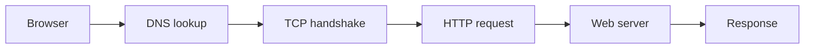

# introduction

A **computer network** connects devices so they can share data and resources. This note doubles as a rendering test: headings, tables, code, diagrams, footnotes and more.

## Key ideas

- A *node* is any device on the network
- A *link* is the medium connecting two nodes
- A *protocol* is the set of rules both sides follow

Some text with <mark>highlighted words</mark>, <u>underlined text</u>, ~~strikethrough~~ and a <span style="color:#ff9f6b">custom colored phrase</span>. Press <kbd>Ctrl</kbd> + <kbd>S</kbd> to save.

## Network types

| Type | Full form | Typical range |
|------|-----------|---------------|
| PAN  | Personal Area Network | A few meters |
| LAN  | Local Area Network | A building |
| MAN  | Metropolitan Area Network | A city |
| WAN  | Wide Area Network | Countries or continents |

## Checklist

- [x] Learn the network types
- [x] Understand protocols
- [ ] Practice subnetting

## Code example

```python
import socket

with socket.socket(socket.AF_INET, socket.SOCK_STREAM) as s:
    s.connect(("example.com", 80))
    s.sendall(b"HEAD / HTTP/1.0\r\n\r\n")
    print(s.recv(1024).decode())
```

```bash
ping -c 4 example.com
```

## Request flow



## Practice question

> **Q1. Which layer of the OSI model is responsible for routing packets?**
>
> - A. Physical
> - B. Network
> - C. Transport
> - D. Session
>
> <details>
> <summary>Click to reveal answer</summary>
>
> **B. Network layer.** It decides the path packets take between networks.
>
> </details>

## Footnotes

Packet switching was developed in the 1960s.[^1] The internet runs on TCP/IP.[^2]

[^1]: Independently by Paul Baran and Donald Davies.
[^2]: Transmission Control Protocol and Internet Protocol.
